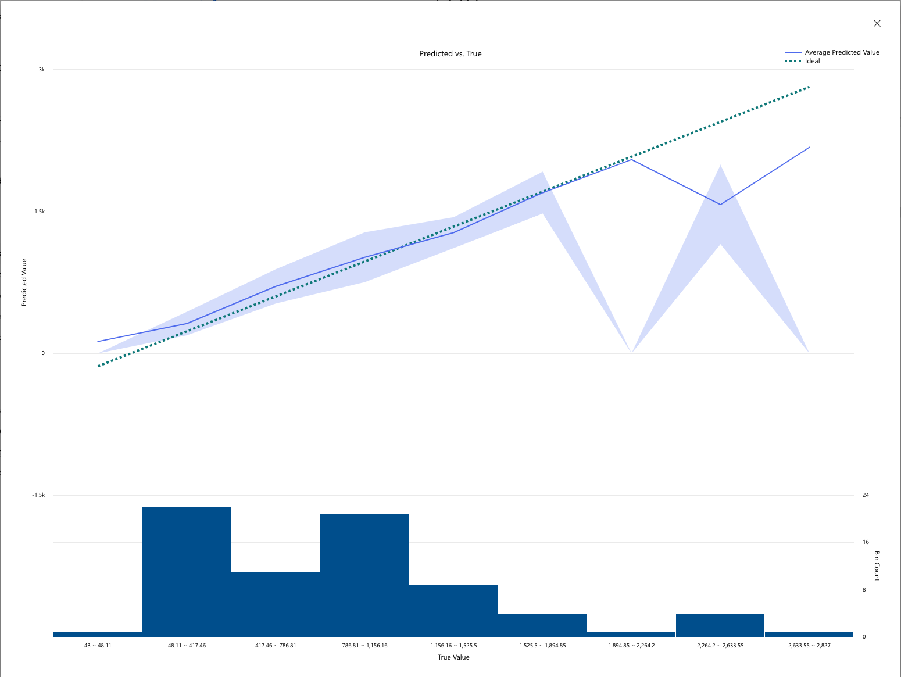
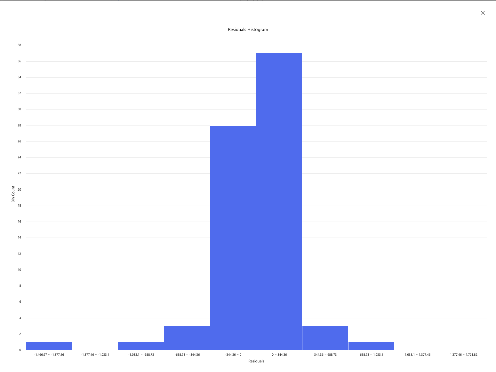
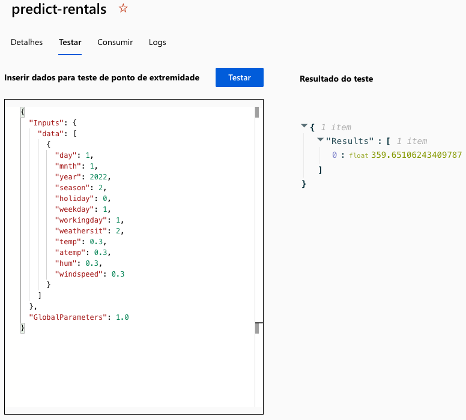

# LAB 1 - Hands-on with Machine Learning at Azure ML

## Roadmap
<table>
  <thead>
    <tr align="left">
      <th>#</th>
      <th>Steps</th>
    </tr>
  </thead>
  <tbody align="left">
    <tr>
      <td>01</td>
      <td>Create an Azure Machine Learning workspace</td>
    </tr>
    <tr>
      <td>02</td>
      <td>Use automated machine learning to train a model</td>
    </tr>
    <tr>
      <td>03</td>
      <td>Review the best model</td> 
    </tr>
    <tr>
      <td>04</td>
      <td>Deploy and test the model</td>
    </tr>
    <tr>
      <td>05</td>
      <td>Test the deployed service</td>
    </tr>
    <tr>
      <td>06</td>
      <td>Clean-up</td>
    </tr>
  </tbody>
  <tfoot></tfoot>
</table>

## Results

### Predicted vs True

### Residuals Histogram

### Test
