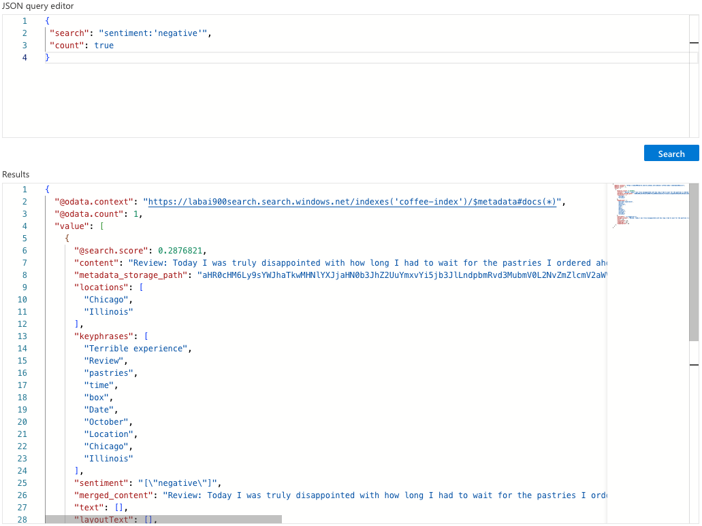

# LAB 4 - Azure Cognitive Search: Using AI Search for Indexing And Data Search

## Exploring an Azure AI Search index (UI)

<table>
  <thead>
    <tr align="left">
      <th>#</th>
      <th>Steps</th>
    </tr>
  </thead>
  <tbody align="left">
    <tr>
      <td>01</td>
      <td>Creating an Azure AI Search resource</td>
    </tr>
    <tr>
      <td>02</td>
      <td>Creating an Azure AI services resource</td>
    </tr>
    <tr>
      <td>03</td>
      <td>Creating a storage account</td>
    </tr>
    <tr>
      <td>04</td>
      <td>Upload Documents to Azure Storage</td>
    </tr>
    <tr>
      <td>05</td>
      <td>Index the documents</td>
    </tr>
    <tr>
      <td>06</td>
      <td>Query the index</td>
    </tr>
    <tr>
      <td>07</td>
      <td>Review the knowledge store</td>
    </tr>
    <tr>
      <td>08</td>
      <td>Clean-up</td>
    </tr>
  </tbody>
  <tfoot></tfoot>
</table>

## Results - Querying The Index

### Search Results
