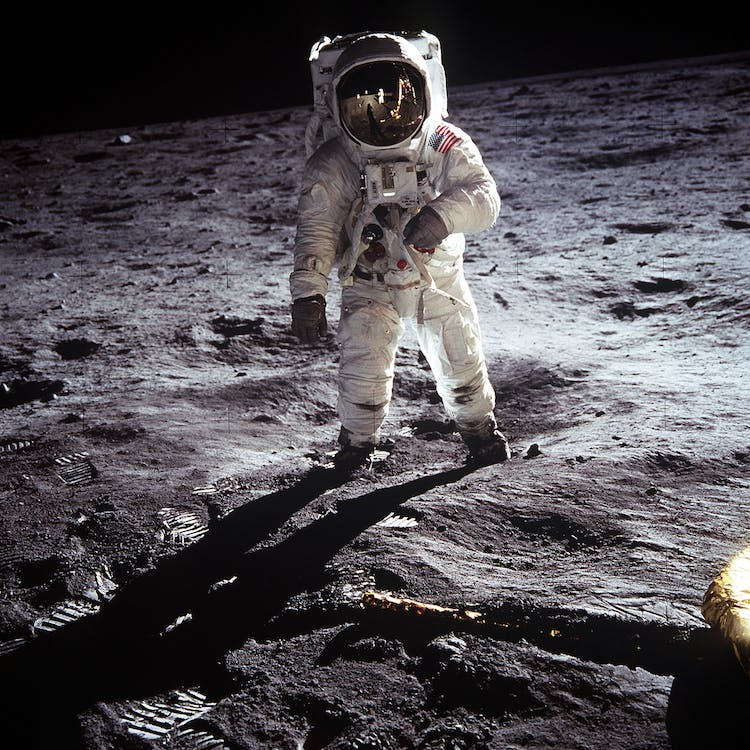

# LAB 5 - Exploring AI Resources With Copilot And OpenAI

## Analyzing images in Vision Studio
Two different types of image analysis were conducted in this lab.

<table>
  <thead>
    <tr align="left">
      <th>#</th>
      <th>Analysis</th>
    </tr>
  </thead>
  <tbody align="left">
    <tr>
      <td>01</td>
      <td>Optical Character Recognition</td>
    </tr>
    <tr>
      <td>02</td>
      <td>Generating captions to images</td>
    </tr>
  </tbody>
  <tfoot></tfoot>
</table>

## Results - Optical Character Recognition

### Las Vegas

#### Output
WELCOME
TOFabulous
LASVEGAS
NEVADA
TESCO
TERRIBLE

##

### Time is precious

#### Output
TIME
IS
PRECIOUS.

##

### Fight today

#### Output
eanondoor
FIGHTTODAY
FORABETTER
TOMORROW!

##

## Results - Add Captions to Images

### Hummingbird

#### Output
A hummingbird flying in the air

##

### Bike rider

#### Output
A man riding a bicycle next to a car

##

### Astronaut

#### Output
An astronaut on the moon

##

### Images source: [pexels](https://pexels.com)